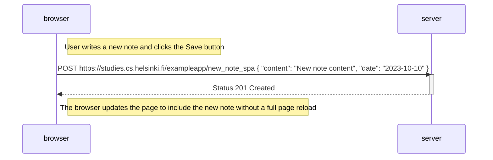

```mermaid
sequenceDiagram
    participant browser
    participant server

    Note right of browser: User writes a new note and clicks the Save button

    browser->>server: POST https://studies.cs.helsinki.fi/exampleapp/new_note_spa { "content": "New note content", "date": "2023-10-10" }
    activate server
    server-->>browser: Status 201 Created
    deactivate server

    Note right of browser: The browser updates the page to include the new note without a full page reload
```